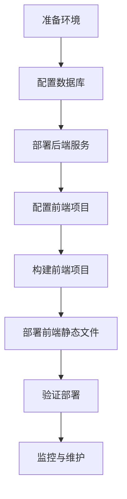

# ROI 数据分析系统 - 部署文档

## 1. 部署概述

本文档详细介绍 ROI 数据分析系统的部署步骤，包括前端和后端的部署过程、环境配置、数据库设置等内容。

## 2. 环境要求

### 2.1 前端环境

- **Node.js**: 14.0 或更高版本
- **包管理器**: pnpm 7.0+ 或 npm 6.0+
- **浏览器**: 现代浏览器（Chrome、Firefox、Safari、Edge）

### 2.2 后端环境

- **Node.js**: 14.0 或更高版本
- **包管理器**: npm 6.0+ 或 yarn
- **数据库**: MySQL 5.7 或更高版本
- **服务器**: 支持 Node.js 运行的服务器

### 2.3 系统要求

- **操作系统**: Linux、macOS、Windows
- **内存**: 至少 2GB RAM
- **存储空间**: 至少 1GB 可用空间

## 3. 后端部署

### 3.1 准备工作

1. **创建数据库**

   - 登录 MySQL 数据库
   - 创建 `roi_data` 数据库
   - 创建 `roi_data` 表

   ```sql
   -- 创建数据库
   CREATE DATABASE IF NOT EXISTS roi_data;

   -- 使用数据库
   USE roi_data;

   -- 创建 roi_data 表
   CREATE TABLE IF NOT EXISTS roi_data (
     id INT AUTO_INCREMENT PRIMARY KEY,
     date DATE NOT NULL,
     app VARCHAR(255) NOT NULL,
     bidType VARCHAR(255) NOT NULL,
     country VARCHAR(255) NOT NULL,
     installs INT NOT NULL,
     roi0 DECIMAL(10,2) NULL,
     roi1 DECIMAL(10,2) NULL,
     roi3 DECIMAL(10,2) NULL,
     roi7 DECIMAL(10,2) NULL,
     roi14 DECIMAL(10,2) NULL,
     roi30 DECIMAL(10,2) NULL,
     roi60 DECIMAL(10,2) NULL,
     roi90 DECIMAL(10,2) NULL,
     created_at TIMESTAMP DEFAULT CURRENT_TIMESTAMP
   );
   ```

2. **配置数据库连接**

   - 编辑 `roi-express/src/config/db.ts` 文件
   - 设置正确的数据库连接信息

   ```typescript
   // roi-express/src/config/db.ts
   import mysql from 'mysql2/promise';

   const pool = mysql.createPool({
     host: 'localhost', // 数据库主机
     user: 'root', // 数据库用户名
     password: 'yourpassword', // 数据库密码
     database: 'roi_data', // 数据库名称
     waitForConnections: true,
     connectionLimit: 10,
     queueLimit: 0,
   });

   export default pool;
   ```

### 3.2 安装依赖

```bash
# 进入后端项目目录
cd roi-express

# 安装基础依赖
npm install

# 安装定时任务库
npm install node-cron
```

### 3.3 构建项目

```bash
# 编译 TypeScript 代码
npm run build
```

### 3.4 启动服务

#### 3.4.1 开发环境

```bash
# 启动开发服务器
npm run dev
```

#### 3.4.2 生产环境

1. **使用 PM2 管理进程**

   ```bash
   # 安装 PM2
   npm install -g pm2

   # 启动服务
   pm2 start dist/app.js --name "roi-express"

   # 设置开机自启
   pm2 save
   pm2 startup
   ```

2. **使用 systemd 管理服务**

   创建服务文件 `/etc/systemd/system/roi-express.service`：

   ```ini
   [Unit]
   Description=ROI Express Service
   After=network.target

   [Service]
   Type=simple
   User=your-user
   WorkingDirectory=/path/to/roi-express
   ExecStart=/usr/bin/node dist/app.js
   Restart=on-failure

   [Install]
   WantedBy=multi-user.target
   ```

   然后启用服务：

   ```bash
   sudo systemctl enable roi-express
   sudo systemctl start roi-express
   ```

### 3.5 验证部署

- 服务启动后，访问 http://localhost:3000/api/roi
- 应该返回 JSON 格式的响应

## 4. 前端部署

### 4.1 安装依赖

```bash
# 进入前端项目目录
cd roi-data-analysis

# 安装依赖
pnpm install
# 或使用 npm
npm install
```

### 4.2 配置 API 地址

- 编辑 `.umirc.ts` 文件
- 设置正确的 API 代理地址

```typescript
// .umirc.ts
proxy: {
  '/api': {
    target: 'http://localhost:3000', // 后端服务地址
    changeOrigin: true,
  },
},
```

### 4.3 构建项目

```bash
# 构建生产版本
npm run build
```

构建完成后，生成的静态文件将位于 `dist` 目录。

### 4.4 部署静态文件

#### 4.4.1 使用 Nginx 部署

1. **配置 Nginx**

   创建 Nginx 配置文件 `/etc/nginx/sites-available/roi-data-analysis`：

   ```nginx
   server {
     listen 80;
     server_name your-domain.com;

     root /path/to/roi-data-analysis/dist;
     index index.html;

     location / {
       try_files $uri $uri/ /index.html;
     }

     # 代理 API 请求到后端服务
     location /api {
       proxy_pass http://localhost:3000;
       proxy_set_header Host $host;
       proxy_set_header X-Real-IP $remote_addr;
       proxy_set_header X-Forwarded-For $proxy_add_x_forwarded_for;
     }
   }
   ```

2. **启用配置**

   ```bash
   sudo ln -s /etc/nginx/sites-available/roi-data-analysis /etc/nginx/sites-enabled/
   sudo nginx -t
   sudo systemctl restart nginx
   ```

#### 4.4.2 使用其他静态文件服务器

- **Apache**：配置虚拟主机，指向 `dist` 目录
- **Caddy**：使用 Caddyfile 配置
- **Netlify/Vercel**：直接部署静态文件

### 4.5 验证部署

- 访问前端应用地址（如 http://your-domain.com）
- 应该能够看到 ROI 数据分析界面
- 检查数据是否正常加载

## 5. 环境变量配置

### 5.1 后端环境变量

创建 `.env` 文件：

```env
# 数据库配置
DB_HOST=localhost
DB_USER=root
DB_PASSWORD=yourpassword
DB_NAME=roi_data

# 服务配置
PORT=3000
NODE_ENV=production
```

### 5.2 前端环境变量

创建 `.env` 文件：

```env
# API 配置
REACT_APP_API_URL=http://your-backend-api.com

# 应用配置
REACT_APP_APP_NAME=ROI数据分析系统
NODE_ENV=production
```

## 6. 数据导入配置

### 6.1 准备 CSV 文件

- 确保 CSV 文件格式正确
- 文件名可以是任意名称，扩展名为 `.csv`
- 放置在 `roi-express/src/assets/` 目录

### 6.2 手动导入数据

如果需要立即导入数据，修改 `roi-express/src/app.ts` 文件：

```typescript
// roi-express/src/app.ts
import { autoImportCSVToDatabase } from './scripts/imporCSV';
import { importCSVToDatabase } from './utils/index';

// 启动定时任务
autoImportCSVToDatabase();

// 立即执行一次导入
importCSVToDatabase();
```

## 7. 监控与维护

### 7.1 日志监控

- **后端日志**：使用 PM2 或 systemd 查看日志
- **Nginx 日志**：查看 `/var/log/nginx/error.log` 和 `/var/log/nginx/access.log`

### 7.2 性能监控

- **使用 Node.js 性能监控工具**：如 New Relic、Datadog
- **使用 MySQL 监控工具**：如 MySQL Enterprise Monitor

### 7.3 定期维护

- **数据库备份**：定期备份 MySQL 数据库
- **依赖更新**：定期更新项目依赖
- **系统更新**：定期更新服务器系统

## 8. 故障排查

### 8.1 常见问题

#### 8.1.1 后端服务无法启动

- **检查**：Node.js 版本是否符合要求
- **检查**：数据库连接是否配置正确
- **检查**：端口是否被占用
- **检查**：依赖包是否安装完整

#### 8.1.2 前端页面无法访问

- **检查**：Nginx 配置是否正确
- **检查**：静态文件路径是否正确
- **检查**：前端构建是否成功

#### 8.1.3 数据无法导入

- **检查**：CSV 文件格式是否正确
- **检查**：数据库连接是否正常
- **检查**：数据库表结构是否正确
- **检查**：定时任务是否正常运行

### 8.2 日志查看

```bash
# 查看 PM2 日志
pm logs roi-express

# 查看 systemd 日志
sudo journalctl -u roi-express

# 查看 Nginx 日志
sudo tail -f /var/log/nginx/error.log
```

## 9. 扩展与优化

### 9.1 性能优化

- **前端**：使用 CDN 加速静态资源，优化图片大小
- **后端**：使用缓存，优化数据库查询
- **数据库**：添加合适的索引，定期清理数据

### 9.2 安全性提升

- **前端**：启用 HTTPS，使用内容安全策略
- **后端**：使用 HTTPS，设置适当的 CORS 策略
- **数据库**：使用强密码，限制数据库用户权限

### 9.3 高可用性

- **负载均衡**：使用 Nginx 或负载均衡器
- **数据库主从复制**：实现数据库高可用
- **自动故障转移**：配置服务自动重启

## 10. 部署流程图



## # ROI 数据分析系统 - 部署文档

## 1. 部署概述

本文档详细介绍 ROI 数据分析系统的部署步骤，包括前端和后端的部署过程、环境配置、数据库设置等内容。

## 2. 环境要求

### 2.1 前端环境

- **Node.js**: 14.0 或更高版本
- **包管理器**: pnpm 7.0+ 或 npm 6.0+
- **浏览器**: 现代浏览器（Chrome、Firefox、Safari、Edge）

### 2.2 后端环境

- **Node.js**: 14.0 或更高版本
- **包管理器**: npm 6.0+ 或 yarn
- **数据库**: MySQL 5.7 或更高版本
- **服务器**: 支持 Node.js 运行的服务器

### 2.3 系统要求

- **操作系统**: Linux、macOS、Windows
- **内存**: 至少 2GB RAM
- **存储空间**: 至少 1GB 可用空间

## 3. 后端部署

### 3.1 准备工作

1. **创建数据库**

   - 登录 MySQL 数据库
   - 创建 `roi_data` 数据库
   - 创建 `roi_data` 表

   ```sql
   -- 创建数据库
   CREATE DATABASE IF NOT EXISTS roi_data;

   -- 使用数据库
   USE roi_data;

   -- 创建 roi_data 表
   CREATE TABLE IF NOT EXISTS roi_data (
     id INT AUTO_INCREMENT PRIMARY KEY,
     date DATE NOT NULL,
     app VARCHAR(255) NOT NULL,
     bidType VARCHAR(255) NOT NULL,
     country VARCHAR(255) NOT NULL,
     installs INT NOT NULL,
     roi0 DECIMAL(10,2) NULL,
     roi1 DECIMAL(10,2) NULL,
     roi3 DECIMAL(10,2) NULL,
     roi7 DECIMAL(10,2) NULL,
     roi14 DECIMAL(10,2) NULL,
     roi30 DECIMAL(10,2) NULL,
     roi60 DECIMAL(10,2) NULL,
     roi90 DECIMAL(10,2) NULL,
     created_at TIMESTAMP DEFAULT CURRENT_TIMESTAMP
   );
   ```

2. **配置数据库连接**

   - 编辑 `roi-express/src/config/db.ts` 文件
   - 设置正确的数据库连接信息

   ```typescript
   // roi-express/src/config/db.ts
   import mysql from 'mysql2/promise';

   const pool = mysql.createPool({
     host: 'localhost', // 数据库主机
     user: 'root', // 数据库用户名
     password: 'yourpassword', // 数据库密码
     database: 'roi_data', // 数据库名称
     waitForConnections: true,
     connectionLimit: 10,
     queueLimit: 0,
   });

   export default pool;
   ```

### 3.2 安装依赖

```bash
# 进入后端项目目录
cd roi-express

# 安装基础依赖
npm install

# 安装定时任务库
npm install node-cron
```

### 3.3 构建项目

```bash
# 编译 TypeScript 代码
npm run build
```

### 3.4 启动服务

#### 3.4.1 开发环境

```bash
# 启动开发服务器
npm run dev
```

#### 3.4.2 生产环境

1. **使用 PM2 管理进程**

   ```bash
   # 安装 PM2
   npm install -g pm2

   # 启动服务
   pm2 start dist/app.js --name "roi-express"

   # 设置开机自启
   pm2 save
   pm2 startup
   ```

2. **使用 systemd 管理服务**

   创建服务文件 `/etc/systemd/system/roi-express.service`：

   ```ini
   [Unit]
   Description=ROI Express Service
   After=network.target

   [Service]
   Type=simple
   User=your-user
   WorkingDirectory=/path/to/roi-express
   ExecStart=/usr/bin/node dist/app.js
   Restart=on-failure

   [Install]
   WantedBy=multi-user.target
   ```

   然后启用服务：

   ```bash
   sudo systemctl enable roi-express
   sudo systemctl start roi-express
   ```

### 3.5 验证部署

- 服务启动后，访问 http://localhost:3000/api/roi
- 应该返回 JSON 格式的响应

## 4. 前端部署

### 4.1 安装依赖

```bash
# 进入前端项目目录
cd roi-data-analysis

# 安装依赖
pnpm install
# 或使用 npm
npm install
```

### 4.2 配置 API 地址

- 编辑 `.umirc.ts` 文件
- 设置正确的 API 代理地址

```typescript
// .umirc.ts
proxy: {
  '/api': {
    target: 'http://localhost:3000', // 后端服务地址
    changeOrigin: true,
  },
},
```

### 4.3 构建项目

```bash
# 构建生产版本
npm run build
```

构建完成后，生成的静态文件将位于 `dist` 目录。

### 4.4 部署静态文件

#### 4.4.1 使用 Nginx 部署

1. **配置 Nginx**

   创建 Nginx 配置文件 `/etc/nginx/sites-available/roi-data-analysis`：

   ```nginx
   server {
     listen 80;
     server_name your-domain.com;

     root /path/to/roi-data-analysis/dist;
     index index.html;

     location / {
       try_files $uri $uri/ /index.html;
     }

     # 代理 API 请求到后端服务
     location /api {
       proxy_pass http://localhost:3000;
       proxy_set_header Host $host;
       proxy_set_header X-Real-IP $remote_addr;
       proxy_set_header X-Forwarded-For $proxy_add_x_forwarded_for;
     }
   }
   ```

2. **启用配置**

   ```bash
   sudo ln -s /etc/nginx/sites-available/roi-data-analysis /etc/nginx/sites-enabled/
   sudo nginx -t
   sudo systemctl restart nginx
   ```

#### 4.4.2 使用其他静态文件服务器

- **Apache**：配置虚拟主机，指向 `dist` 目录
- **Caddy**：使用 Caddyfile 配置
- **Netlify/Vercel**：直接部署静态文件

### 4.5 验证部署

- 访问前端应用地址（如 http://your-domain.com）
- 应该能够看到 ROI 数据分析界面
- 检查数据是否正常加载

## 5. 环境变量配置

### 5.1 后端环境变量

创建 `.env` 文件：

```env
# 数据库配置
DB_HOST=localhost
DB_USER=root
DB_PASSWORD=yourpassword
DB_NAME=roi_data

# 服务配置
PORT=3000
NODE_ENV=production
```

### 5.2 前端环境变量

创建 `.env` 文件：

```env
# API 配置
REACT_APP_API_URL=http://your-backend-api.com

# 应用配置
REACT_APP_APP_NAME=ROI数据分析系统
NODE_ENV=production
```

## 6. 数据导入配置

### 6.1 准备 CSV 文件

- 确保 CSV 文件格式正确
- 文件名可以是任意名称，扩展名为 `.csv`
- 放置在 `roi-express/src/assets/` 目录

### 6.2 手动导入数据

如果需要立即导入数据，修改 `roi-express/src/app.ts` 文件：

```typescript
// roi-express/src/app.ts
import { autoImportCSVToDatabase } from './scripts/imporCSV';
import { importCSVToDatabase } from './utils/index';

// 启动定时任务
autoImportCSVToDatabase();

// 立即执行一次导入
importCSVToDatabase();
```

## 7. 监控与维护

### 7.1 日志监控

- **后端日志**：使用 PM2 或 systemd 查看日志
- **Nginx 日志**：查看 `/var/log/nginx/error.log` 和 `/var/log/nginx/access.log`

### 7.2 性能监控

- **使用 Node.js 性能监控工具**：如 New Relic、Datadog
- **使用 MySQL 监控工具**：如 MySQL Enterprise Monitor

### 7.3 定期维护

- **数据库备份**：定期备份 MySQL 数据库
- **依赖更新**：定期更新项目依赖
- **系统更新**：定期更新服务器系统

## 8. 故障排查

### 8.1 常见问题

#### 8.1.1 后端服务无法启动

- **检查**：Node.js 版本是否符合要求
- **检查**：数据库连接是否配置正确
- **检查**：端口是否被占用
- **检查**：依赖包是否安装完整

#### 8.1.2 前端页面无法访问

- **检查**：Nginx 配置是否正确
- **检查**：静态文件路径是否正确
- **检查**：前端构建是否成功

#### 8.1.3 数据无法导入

- **检查**：CSV 文件格式是否正确
- **检查**：数据库连接是否正常
- **检查**：数据库表结构是否正确
- **检查**：定时任务是否正常运行

### 8.2 日志查看

```bash
# 查看 PM2 日志
pm logs roi-express

# 查看 systemd 日志
sudo journalctl -u roi-express

# 查看 Nginx 日志
sudo tail -f /var/log/nginx/error.log
```

## 9. 扩展与优化

### 9.1 性能优化

- **前端**：使用 CDN 加速静态资源，优化图片大小
- **后端**：使用缓存，优化数据库查询
- **数据库**：添加合适的索引，定期清理数据

### 9.2 安全性提升

- **前端**：启用 HTTPS，使用内容安全策略
- **后端**：使用 HTTPS，设置适当的 CORS 策略
- **数据库**：使用强密码，限制数据库用户权限

### 9.3 高可用性

- **负载均衡**：使用 Nginx 或负载均衡器
- **数据库主从复制**：实现数据库高可用
- **自动故障转移**：配置服务自动重启

## 10. 部署流程图


## 11. 部署清单

### 11.1 后端部署

- [ ] 安装 Node.js
- [ ] 安装 MySQL
- [ ] 创建数据库和表
- [ ] 配置数据库连接
- [ ] 安装依赖
- [ ] 构建项目
- [ ] 启动服务
- [ ] 验证 API 接口

### 11.2 前端部署

- [ ] 安装 Node.js
- [ ] 安装依赖
- [ ] 配置 API 地址
- [ ] 构建项目
- [ ] 部署静态文件
- [ ] 配置 Nginx
- [ ] 验证前端应用

### 11.3 数据配置

- [ ] 准备 CSV 数据文件
- [ ] 测试数据导入
- [ ] 验证数据显示

## 12. 版本控制

| 版本  | 日期       | 变更内容            |
| ----- | ---------- | ------------------- |
| 1.0.0 | 2024-01-01 | 初始部署文档        |
| 1.0.1 | 2024-01-15 | 添加 PM2 部署说明   |
| 1.1.0 | 2024-02-01 | 添加 Nginx 配置示例 |
| 1.1.1 | 2024-02-15 | 完善故障排查部分    |

## 13. 结束语

本部署文档提供了 ROI 数据分析系统的完整部署指南，包括前端和后端的部署步骤、环境配置、数据库设置等内容。按照文档中的步骤操作，可以确保系统的顺利部署和稳定运行。

在部署过程中，如有任何问题，请参考故障排查部分或联系技术支持。

---

**注意**：本部署文档仅供参考，实际部署时请根据具体环境进行适当调整。 . 部署清单

### 11.1 后端部署

- [ ] 安装 Node.js
- [ ] 安装 MySQL
- [ ] 创建数据库和表
- [ ] 配置数据库连接
- [ ] 安装依赖
- [ ] 构建项目
- [ ] 启动服务
- [ ] 验证 API 接口

### 11.2 前端部署

- [ ] 安装 Node.js
- [ ] 安装依赖
- [ ] 配置 API 地址
- [ ] 构建项目
- [ ] 部署静态文件
- [ ] 配置 Nginx
- [ ] 验证前端应用

### 11.3 数据配置

- [ ] 准备 CSV 数据文件
- [ ] 测试数据导入
- [ ] 验证数据显示

## 12. 版本控制

| 版本  | 日期       | 变更内容            |
| ----- | ---------- | ------------------- |
| 1.0.0 | 2024-01-01 | 初始部署文档        |
| 1.0.1 | 2024-01-15 | 添加 PM2 部署说明   |
| 1.1.0 | 2024-02-01 | 添加 Nginx 配置示例 |
| 1.1.1 | 2024-02-15 | 完善故障排查部分    |

## 13. 结束语

本部署文档提供了 ROI 数据分析系统的完整部署指南，包括前端和后端的部署步骤、环境配置、数据库设置等内容。按照文档中的步骤操作，可以确保系统的顺利部署和稳定运行。

在部署过程中，如有任何问题，请参考故障排查部分或联系技术支持。

---

**注意**：本部署文档仅供参考，实际部署时请根据具体环境进行适当调整。
