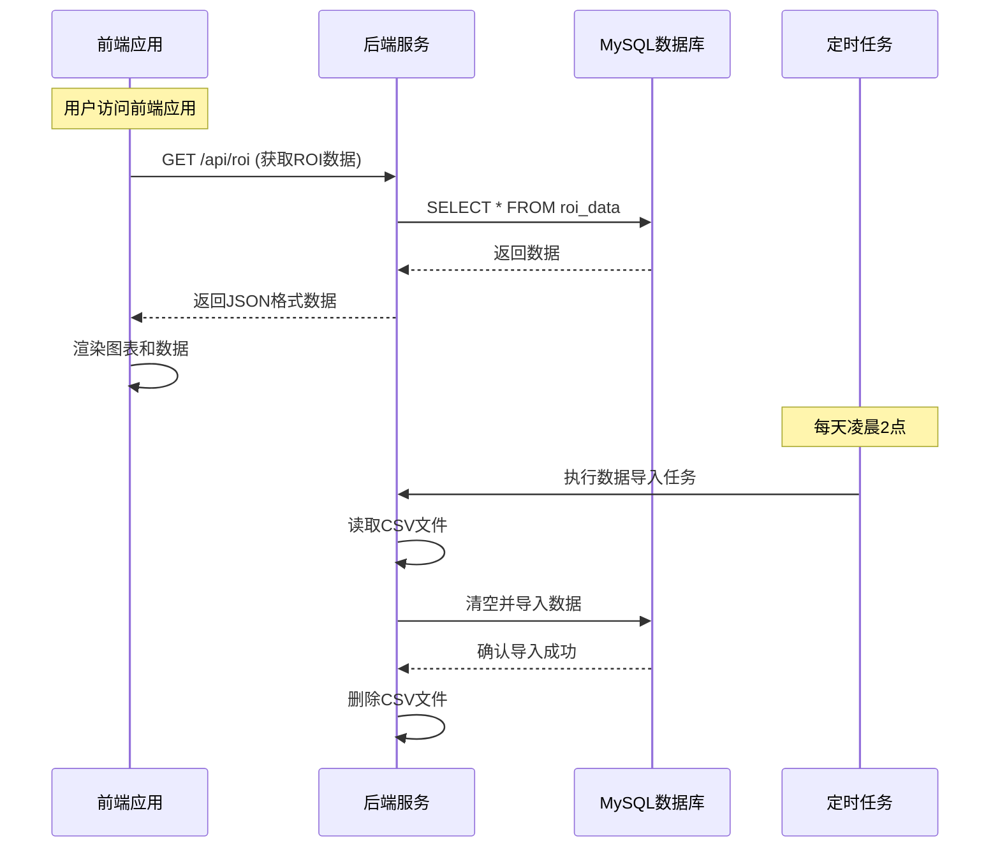
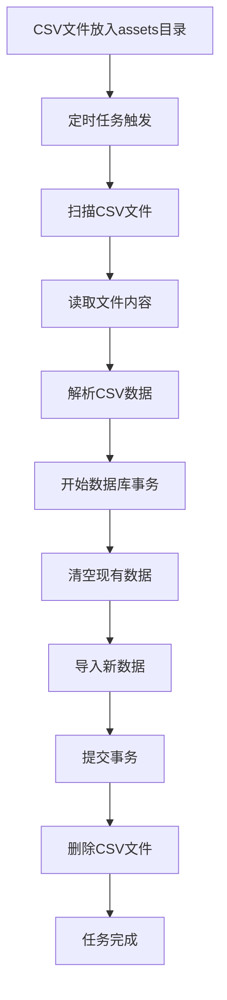
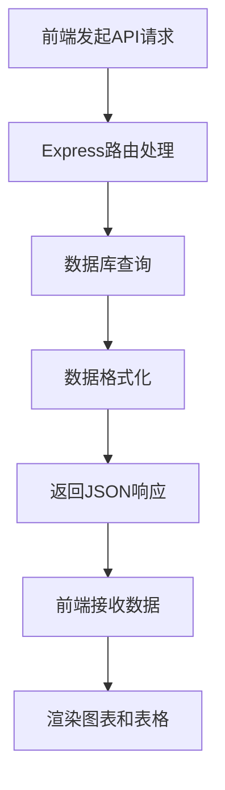

# ROI 数据分析系统设计文档

## 1. 系统架构

### 1.1 整体架构

ROI 数据分析系统采用前后端分离的架构设计：



### 1.2 技术栈

| 类别         | 技术       | 版本   | 用途             |
| ------------ | ---------- | ------ | ---------------- |
| 前端框架     | React      | 18+    | 构建用户界面     |
| 前端构建工具 | Umi.js     | 4.6.39 | 项目脚手架和构建 |
| UI 组件库    | Ant Design | 5.4.0  | 提供 UI 组件     |
| 图表库       | Recharts   | 3.8.1  | 数据可视化       |
| 状态管理     | Umi Model  | -      | 应用状态管理     |
| HTTP 客户端  | Axios      | 1.14.0 | API 调用         |
| 后端框架     | Express    | 5.2.1  | 构建 API 服务    |
| 数据库       | MySQL      | -      | 数据存储         |
| 定时任务     | node-cron  | -      | 自动数据导入     |
| 语言         | TypeScript | 5.4.3  | 类型安全         |

## 2. 数据流程

### 2.1 数据导入流程



### 2.2 数据查询流程



## 3. 关键设计决策

### 3.1 数据存储设计

- **选择 MySQL 数据库**：关系型数据库适合存储结构化的 ROI 数据，支持复杂查询
- **表结构设计**：单表设计，包含所有必要字段，便于查询和管理
- **数据清空策略**：每次导入时清空现有数据，确保数据一致性

### 3.2 定时任务设计

- **使用 node-cron**：轻量级定时任务库，适合简单的定时操作
- **执行时间**：每天凌晨 2 点，避免影响系统正常使用
- **错误处理**：完善的错误捕获和日志记录

### 3.3 前端设计

- **响应式布局**：适配不同屏幕尺寸
- **数据可视化**：使用 Recharts 实现多种图表展示

### 3.4 性能优化

- **数据库连接池**：使用连接池提高数据库操作效率
- **事务处理**：批量导入数据，减少数据库操作次数
- **前端缓存**：合理使用缓存，减少重复请求

## 4. 系统组件

### 4.1 前端组件

| 组件名称 | 路径                     | 功能描述                            |
| -------- | ------------------------ | ----------------------------------- |
| Home     | src/pages/Home/index.tsx | 主页面，显示 ROI 数据分析图表和数据 |
| 服务层   | src/services/index.ts    | API 服务，处理与后端的通信          |
| 工具函数 | src/utils/format.ts      | 数据格式化工具                      |
| 全局模型 | src/models/global.ts     | 应用状态管理                        |

### 4.2 后端组件

| 组件名称 | 路径 | 功能描述 |
| --- | --- | --- |
| 应用入口 | src/app.ts | 启动 Express 服务，配置中间件和路由 |
| 路由 | src/routes/roi.ts | 处理 ROI 数据查询请求 |
| 定时任务 | src/scripts/imporCSV.ts | 自动导入 CSV 数据 |
| 数据导入 | src/utils/index.ts | 处理 CSV 数据导入逻辑 |
| 数据库配置 | src/config/db.ts | 数据库连接配置 |
| 响应中间件 | src/middleware/response.ts | 统一 API 响应格式 |

## 5. 数据库设计

### 5.1 表结构

**表名**: roi_data

| 字段名     | 数据类型      | 约束                       | 描述         |
| ---------- | ------------- | -------------------------- | ------------ |
| id         | INT           | AUTO_INCREMENT PRIMARY KEY | 自增主键     |
| date       | DATE          | NOT NULL                   | 数据日期     |
| app        | VARCHAR(255)  | NOT NULL                   | 应用名称     |
| bidType    | VARCHAR(255)  | NOT NULL                   | 出价类型     |
| country    | VARCHAR(255)  | NOT NULL                   | 国家地区     |
| installs   | INT           | NOT NULL                   | 应用安装次数 |
| roi0       | DECIMAL(10,2) | NULL                       | 当日 ROI     |
| roi1       | DECIMAL(10,2) | NULL                       | 1 日 ROI     |
| roi3       | DECIMAL(10,2) | NULL                       | 3 日 ROI     |
| roi7       | DECIMAL(10,2) | NULL                       | 7 日 ROI     |
| roi14      | DECIMAL(10,2) | NULL                       | 14 日 ROI    |
| roi30      | DECIMAL(10,2) | NULL                       | 30 日 ROI    |
| roi60      | DECIMAL(10,2) | NULL                       | 60 日 ROI    |
| roi90      | DECIMAL(10,2) | NULL                       | 90 日 ROI    |
| created_at | TIMESTAMP     | DEFAULT CURRENT_TIMESTAMP  | 创建时间     |

### 5.2 索引设计

| 索引类型 | 字段    | 目的             |
| -------- | ------- | ---------------- |
| 主键索引 | id      | 唯一标识记录     |
| 普通索引 | date    | 加速日期查询     |
| 普通索引 | app     | 加速应用查询     |
| 普通索引 | country | 加速国家地区查询 |

## 6. API 设计

### 6.1 接口列表

| API 路径 | 方法 | 功能描述      | 请求参数 | 响应格式      |
| -------- | ---- | ------------- | -------- | ------------- |
| /api/roi | GET  | 获取 ROI 数据 | 无       | JSON 格式数据 |

### 6.2 响应格式

```json
{
  "success": true,
  "data": [
    {
      "date": "2024-01-01",
      "app": "App Name",
      "bidType": "CPI",
      "country": "US",
      "installs": 100,
      "roi0": 12.5,
      "roi1": 15.2,
      "roi3": 18.7,
      "roi7": 20.5,
      "roi14": 22.1,
      "roi30": 25.3,
      "roi60": 28.9,
      "roi90": 30.2
    }
  ],
  "message": "获取数据成功"
}
```

## 7. 安全设计

### 7.1 后端安全

- **输入验证**：对所有输入数据进行验证，防止 SQL 注入
- **错误处理**：不暴露详细错误信息给客户端
- **数据库连接**：使用参数化查询，避免 SQL 注入

### 7.2 前端安全

- **XSS 防护**：对用户输入进行过滤和转义
- **CSRF 防护**：使用合适的 CSRF 防护措施
- **数据验证**：前端验证用户输入，提高用户体验

## 8. 部署方案

### 8.1 前端部署

- **构建**：`npm run build` 生成静态文件
- **部署**：将构建产物部署到静态文件服务器
- **环境变量**：配置 API 地址等环境变量

### 8.2 后端部署

- **构建**：`npm run build` 编译 TypeScript 代码
- **部署**：将编译后的代码部署到服务器
- **环境变量**：配置数据库连接信息等环境变量
- **进程管理**：使用 PM2 等工具管理进程

## 9. 监控与维护

### 9.1 日志记录

- **后端日志**：记录 API 请求、错误信息和定时任务执行情况
- **前端日志**：记录用户操作和错误信息

### 9.2 监控指标

- **API 响应时间**：监控 API 响应速度
- **数据库性能**：监控数据库查询性能
- **系统负载**：监控服务器负载情况

### 9.3 维护计划

- **定期备份**：定期备份数据库
- **版本更新**：及时更新依赖包，修复安全漏洞
- **性能优化**：根据监控数据进行性能优化

## 10. 扩展性设计

### 10.1 功能扩展

- **数据来源扩展**：支持更多数据来源，如 API 接口、Excel 文件等
- **分析维度扩展**：增加更多分析维度，如渠道、设备等
- **报表导出**：支持导出报表功能

### 10.2 技术扩展

- **微服务架构**：考虑将系统拆分为多个微服务
- **缓存系统**：引入缓存系统，提高查询性能
- **消息队列**：使用消息队列处理异步任务

## 11. 总结

ROI 数据分析系统采用前后端分离的架构设计，使用现代化的技术栈，实现了数据的自动导入、存储和可视化分析。系统设计考虑了性能、安全和扩展性，为用户提供了一个功能完善、易于使用的数据分析工具。

通过定时任务自动导入 CSV 数据，减少了手动操作的工作量；通过直观的图表展示，帮助用户快速了解 ROI 数据的变化趋势；通过统一的 API 接口，为后续功能扩展提供了良好的基础。

系统设计遵循了模块化、可维护性和可扩展性的原则，为未来的功能迭代和技术升级做好了准备。
